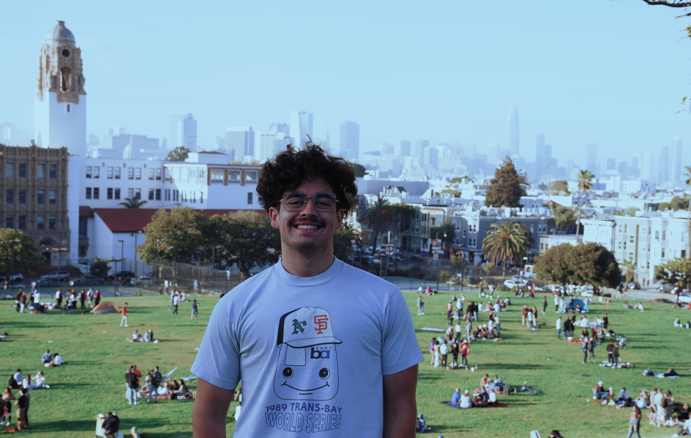

# Tyler Nunez
## I'm a recent Data Science & Political Science graduate from UC Bekeley that enjoys leveraging data-driven techniques for baseball analyics.

## Skills: Python, Java, SQL, HTML, CSS, JavaScript, artificial intelligence, pathfinding algorithms, NLP, neural networks, social media strategies, public speaking, improvisation, Salesforce, web design, Figma, Trackman, sci-kit learn, PITCHf/x
|      Employer      | Job Description                                                                                                                                                                                                                                                    | Location         |
|:------------------:|--------------------------------------------------------------------------------------------------------------------------------------------------------------------------------------------------------------------------------------------------------------------|------------------|
|    Cal Baseball    |- Develop data-driven scouting reports and visualizations using Trackman data and Synergy. - Manage video and pitch tracking for Trackman and PITCHF/x during games. - Curate video for Cal Athletics Communications Director to be used for social media content. | Berkeley, CA     |
|     TANDM Surf     |- Create Lo-Fi designs for a mobile application using Figma. - Develop noSQL database schema for storing user data. - Building profile screens for mobile application using React Native.                                                                          | San Clemente, CA |
| Cal Calling Center |- Communicate the current state of campus affairs to alumni. - Followed call center scripts and used improvisational skills during solicitation calls. - Maintained relationships with donating alumni upon initial contact.                                       | Berkeley, CA     |
